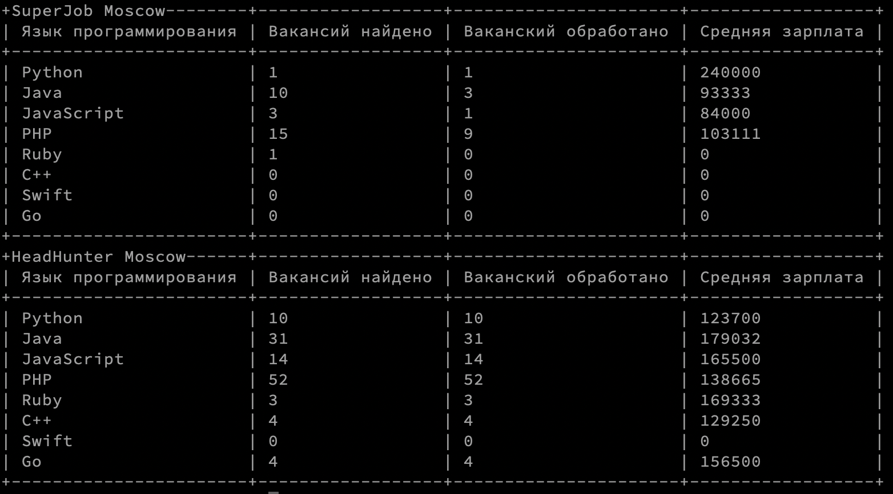

# Get WorkBetter

Скрипт скачивает все вакансии по программированию в городе Москва с сайтов вакансии [HeadHunter](https://hh.ru) и [SuperJob](https://superjob.ru) и выводит в виде таблицы статистику по языкам программирования.

В результате выполнения вы молучите такие таблицы:




## Как установить

Python3 должен быть уже установлен в системе.  
Используя `pip` или  `pip3`  (если есть конфликт с python2) необходимо установить  зависимости:

```shell
pip install -r requirements.txt
```

Рекомендуется использовать виртуальное окружение для изоляции проекта.  
Подробности: [virtualenv/venv](https://docs.python.org/3/library/venv.html).

### Получение TOKEN для SuperJob

Для получения данных с сайта [SuperJob](https://superjob.ru) необходимо получить **TOKEN** для авторизации.  
Зарегистрируйте своё приложение [здесь](https://api.superjob.ru/register/)

После получения **TOKEN** добавьте его в файл `.env` в директории со скриптами.

В файле  `.env` написать:

```
SECRET_KEY_SUPER_JOB=ВАШ_TOKEN
```

## Как запустить скрипт

```shell
python3 main.py
```

*Внимание*! Скрипт может выполняться несколько минут. 

## Цель проекта

Данные скрипты написаны только с образовательной целью. 